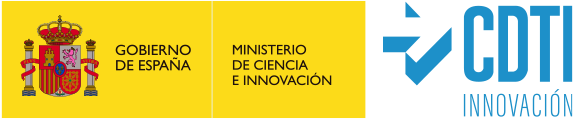

# 5R - Premio Cervera

&nbsp;
&nbsp;

Este concurso se encuentra enmarcado dentro de las actividades del proyecto “**5R – Red Cervera de tecnologías robóticas en fabricación inteligente**”, financiado por el **Ministerio de Ciencia e Innovación** a través del **Centro para el Desarrollo Tecnológico Industrial (CDTI)**, número de contrato **CER-20211007**, en el marco del programa “**Centros Tecnológicos de Excelencia Cervera**”. La red se encuentra formada por los siguientes centros: **TEKNIKER**, **EURECAT**, **AIMEN**, **CARTIF** y **CATEC**.

El **proyecto** **5R** se basa en el desarrollo de tecnologías robóticas, así como la creación de una Fábrica Piloto por cada uno de los centros participantes. **5R** tiene la misión de establecer una red colaborativa, con las tecnologías, herramientas e infraestructuras necesarias para actuar como elemento tractor del desarrollo e introducción de nuevas tecnologías robóticas en el tejido industrial de fabricación español.

Gracias al lanzamiento de este reto se pretende dar a conocer la red formada por los distintos centros tecnológicos españoles, así como las actividades de estos y el acercamiento a las universidades.

## Descripción

El concurso consiste en resolver un problema de **segmentación** de instancias. La segmentación de instancias de una escena es un proceso avanzado de visión por ordenador que va más allá de la simple detección de objetos o la segmentación semántica. Mientras que la detección de objetos se centra en identificar la ubicación y la categoría de los objetos de una imagen, y la segmentación semántica trata de comprender y etiquetar cada píxel de la imagen como parte de una categoría de objetos, la segmentación instantánea combina estos conceptos.

Por lo tanto, el reto será **desarrollar** un **algoritmo** que pueda identificar y segmentar cada objeto individual dentro de una imagen, es decir, que reconozca y separe múltiples instancias del mismo tipo de objeto. Al mismo tiempo, debe ser capaz de generar una máscara de píxeles que cubra exactamente la instancia del objeto, separándola no solo del fondo, sino también de otras instancias.

## Evaluación

Los participantes se enfrentan a varios retos, entre los que destacan:

- **Oclusión y solapamiento:** instancias de objetos que se solapan u ocultan entre sí, lo que complica su identificación individual y segmentación.
- **Eficacia y rendimiento:** conseguir una alta precisión de segmentación manteniendo un rendimiento computacional aceptable

## Evaluación y testeo

### Visión general de la intersección sobre la Unión (IoU)

La intersección sobre la unión (IoU), también conocida como índice de Jaccard, es una métrica muy utilizada para evaluar el rendimiento de los algoritmos de detección y segmentación de objetos. Se trata de una medida del solapamiento entre un recuadro o máscara de predicción y su equivalente real.

##### Fórmula:

$$ IoU = \frac{|A \cap B|}{|A \cup B|} $$

Donde: 
- **A** es la máscara predicha
- **B** es máscara real

La puntuación **IoU** oscila entre 0 y 1, donde 0 indica que no hay solapamiento y 1 indica un solapamiento perfecto. Una puntuación **IoU** más alta indica una mejor coincidencia entre la máscara predicha y la máscara real.

##### Beneficios del IoU:

**Simplicidad**: El **IoU** es una métrica sencilla de entender y calcular.
**Robustez**: **IoU** es relativamente insensible a pequeñas variaciones en las segmentaciones, lo que es importante para las aplicaciones del mundo real.

### Descripción de métrica

El rendimiento global de la segmentación se evalúa calculando la puntuación media del **IoU** en todas las imágenes. La puntuación **IoU** de cada imagen se calcula promediando la puntuación IoU de cada máscara de objeto dentro de esa imagen.

##### Fórmula

Específicamente, para la imagen i, la puntuación **IoU** se calcula para cada máscara de objeto individual j dentro de esa imagen. La media de estas puntuaciones representa la puntuación final **IoU_i** de la imagen. Esto se expresa matemáticamente como:

$$ \text{IoU}{i} = \frac{1}{M_{i}}\sum_{j=1}^{M_{i}}\text{IoU}_{ij} $$

Donde: 
- **M_i** es el número total de máscaras de los objetos en la imagen i 
- **IoU_ij** es la puntuación de la intersección sobre la unión de la j-ésima máscara en la imagen i

$$ \text{Final Score} = \frac{1}{N}\sum_{i=1}^{N}\text{IoU}_{i} $$

Donde: 
- **N** es el número total de imágenes del conjunto de datos 
- **IoU_i** es la puntuación media de la intersección sobre la unión de la imagen i

### Coincidencia de máscaras reales y previstas

**Coincidencia de máscaras reales y máscaras predichas**: Para cada máscara real, la máscara predicha con el IoU más alto se va a considerar la máscara predicha correspondiente. De este modo se garantiza que cada máscara real coincida con la máscara predicha que mejor represente su forma y ubicación.

**IoU Threshold**: Sólo se tienen en cuenta para la puntuación las máscaras reales con una puntuación IoU superior a un determinado umbral (0,5 en este reto). Esto ayuda a filtrar las predicciones que sólo están débilmente correlacionadas con las máscaras reales. Así se garantiza que la evaluación se centre en las coincidencias más significativas y se evitan puntuaciones infladas debido a predicciones demasiado conservadoras.

### Codificación de máscaras a String (cadena)

Para reducir el tamaño del archivo CSV enviado y simplificar el proceso de evaluación, las máscaras pronosticadas se codifican utilizando un formato especial. Este esquema de codificación consiste en convertir las máscaras binarias al formato de codificación de longitud de ejecución (RLE), comprimir las cadenas RLE y, a continuación, codificarlas utilizando la codificación base64.

Las funciones de codificación y el ejemplo de codificación CSV están disponibles en el cuaderno Jupyter proporcionado **Coco Encoding Compressing Script**.

**RLE (Run-length encoding)**: RLE es una representación compacta de máscaras binarias que explota la naturaleza repetitiva de los píxeles. Funciona sustituyendo tramos consecutivos de píxeles idénticos por un único código que indica la longitud del tramo. Esto reduce significativamente el tamaño de la representación de la máscara codificada.

**Compresión zlib**: Las cadenas RLE comprimidas se comprimen aún más utilizando el algoritmo de compresión zlib. Esto reduce aún más el tamaño de las máscaras codificadas, haciendo más eficiente su almacenamiento y transmisión.

**Codificación Base64**: El paso final es codificar las cadenas RLE comprimidas utilizando la codificación base64. La codificación base64 garantiza que las máscaras codificadas puedan almacenarse y transmitirse como una cadena de texto estándar, lo que las hace compatibles con diversos formatos de datos y protocolos.

Las cadenas codificadas resultantes se incluyen en la columna "**EncodedMasks**" del archivo CSV de envío.

### Descodificación de máscaras a partir de String (cadena)

Para evaluar las máscaras predichas, las cadenas codificadas en el archivo CSV enviado deben descodificarse en máscaras binarias. Este proceso implica los siguientes pasos:

**Descodificación Base64**: Las cadenas codificadas se decodifican primero a partir del formato base64. Esto convierte las máscaras codificadas de nuevo en cadenas binarias.

**Descompresión RLE**: Las cadenas binarias descodificadas se descomprimen utilizando el algoritmo de descompresión zlib. Esto restaura las representaciones RLE de las máscaras.

**Conversión de RLE a máscara binaria**: Las cadenas RLE se convierten en máscaras binarias utilizando la API COCO. Este proceso invierte el proceso de codificación para obtener las máscaras binarias originales.

Las funciones de descodificación y el ejemplo de descodificación CSV están disponibles en el cuaderno Jupyter proporcionado **Coco Decoding Decompressing Script**.

### Formato de envío

#### Formato CSV y envío

El archivo CSV de envío debe tener las siguientes columnas:

**ID**: Identificador único de la imagen (también llamado escena).

**Width**: La anchura de la imagen

**Height**: La altura de la imagen

**EncodedMasks**: Las máscaras binarias codificadas para la imagen (separadas por espacios).

Es importante asegurarse de que el archivo CSV enviado tiene el formato correcto y de que están presentes todas las columnas requeridas. Cualquier incoherencia en el formato o ausencia de columnas puede dar lugar a errores de evaluación.

### Reglas

El archivo CSV de envío no debe estar vacío y debe tener el mismo número de líneas que el archivo CSV de prueba. Esto garantiza que el envío contiene predicciones para todas las imágenes del conjunto de prueba.

Si una predicción está vacía (no se ha detectado ninguna máscara para una determinada imagen), ponga un símbolo aleatorio en la columna "EncodedMasks" y rellene las columnas "ID", "Width" y "Height" como siempre. Esto indica que no hay ninguna predicción para esa imagen en particular.

Asegúrese de que la columna "EncodedMasks" sólo contiene cadenas de máscaras codificadas válidas. Las máscaras codificadas no válidas o dañadas provocarán errores durante el proceso de evaluación. Las máscaras codificadas deben ir separadas por un espacio.

Para obtener los mejores resultados, utilice el código proporcionado para codificar y descodificar las máscaras. Este código garantiza que los procesos de codificación y descodificación sean coherentes y precisos.

Ejemplo de envío CSV:

**ID** | **Width** | **Height** | **EncodedMasks**
1 | 1920 | 1080 | MáscaraCodificada1 MáscaraCodificada2 MáscaraCodificada3 ...
2 | 1920 | 1080 | MáscaraCodificada1 ...
3 | 1920 | 1080 | MáscaraCodificada1 MáscaraCodificada2 ...
...	  ...	          ...	                        ...

&nbsp;
&nbsp;

El proyecto 5R está financiado por el Ministerio de Ciencia e Innovación a través del Centro para el Desarrollo Tecnológico Industrial (CDTI), número de contrato CER-20211007, en el marco del programa “Centros Tecnológicos de Excelencia Cervera”

